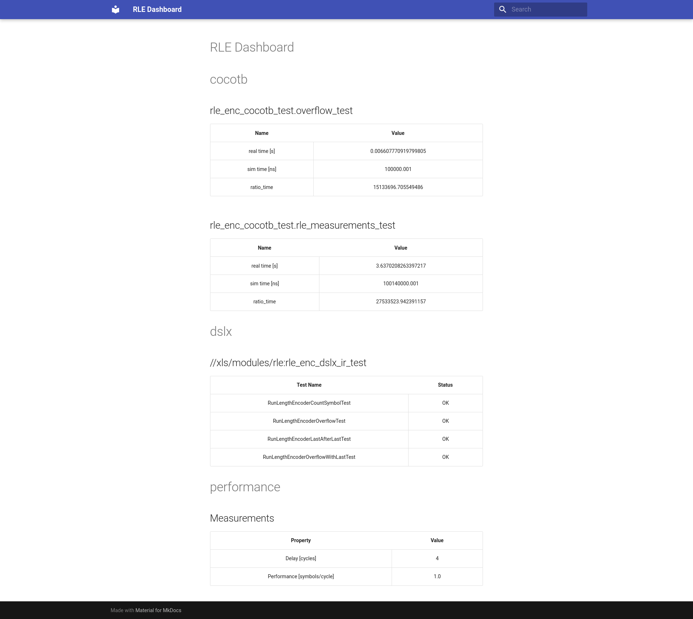

# xls-dashboard

Copyright (C) Antmicro 2023 - 2025

This repository contains a demo for dashboard generation in XLS demonstrated by two examples - a simple dashboard for a passthrough example and a more complex dashboard for a basic RLE encoder design.

The dashboard is generated from data extracted from tests or their output.
To extract the data, users may use parsers provided in this repo or their custom scripts, which are responsible for extracting the information and saving it in a Dashboard JSON format.
Custom parsers should read the log from stdin and write the extracted information to stdout.

The dashboard generation is done in a few steps. The whole process is controlled by the main `dashboard.py` script. Generating a dashboard is as follows:

1. The `dashboard.py` script is invoked with a set of parameters that specify two types of operations: parsing output of a test (`-p` option) or parsing output files generated by the test (`-f` option). The arguments contain information about the test to run, the parser to use, and the potential file from which the data should be extracted. The script parses arguments and saves them in a more convenient form internally.
2. The tests are then executed and parsed using the run_and_parse function from the run_and_parse.py file. For the `-p` option, the parser is run on the log produced by the test, for the `-f` option, the parser is run on the output file created by the test. The output files are assumed to be located in `$TEST_UNDECLARED_OUTPUTS_DIR`, which is a default location for output files produced by Bazel tests.
3. The parsed data in JSON format is collected and then verified if it matches the Dashboard JSON schema. Both the verification mechanism and the schema are available in the `validate_dashboard_json.py` file.
4. Next, the correct piece of information in the Dashboard JSON format is sorted and converted to a markdown file by the `json_to_markdown` function from the Python file with the same name.
5. Finally, the utilities from `mkdocs_creator.py` are used to produce an HTML using `mkdocs`.


Since the dashboard relies on tests, it cannot be produced on build time. To generate the dashboard, one has to provide a path to which the HTML should be saved. For example:

```
$ bazel run -- //xls/modules/rle:rle_dashboard -o rle_dashboard
```

Here is a screenshot of the RLE Dashboard:


## Running locally
To run example locally you need to install bazel 5.4.0 (or bazelisk, which will automatically use correct version), clang++, python3 and libtinfo5
```
# Download and enter xls directory
$ git clone --recursive https://github.com/antmicro/xls-dashboard
$ cd xls-dashboard

# Build xls, run rle test and produce dashboard to `rle_dashboard/`
$ bazel run -- //xls/modules/rle:rle_dashboard -o rle_dashboard/

# Open dashboard in browser
$ xdg-open rle_dashboard/index.html

# Same for passthrough example
$ bazel run -- //xls/examples:passthrough_dashboard -o passthrough_dashboard/
$ xdg-open passthrough_dashboard/index.html
```
